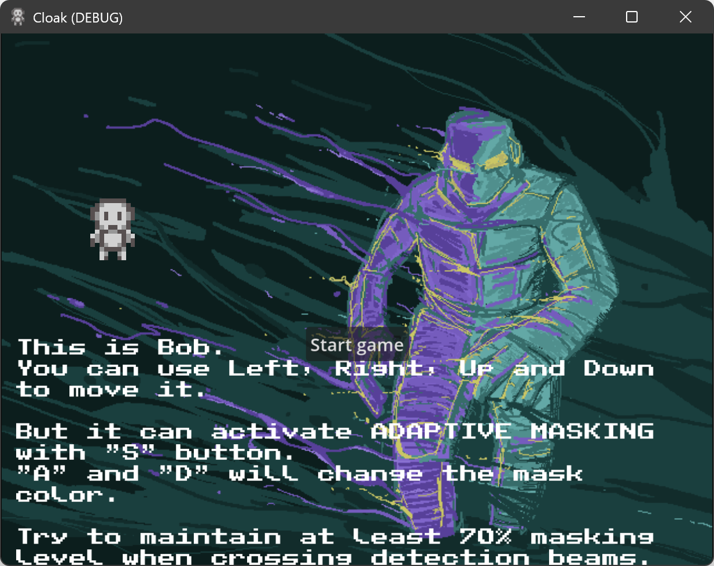
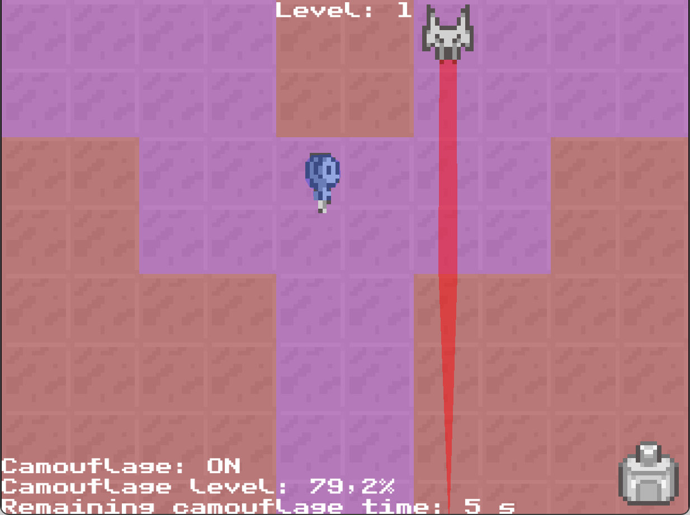
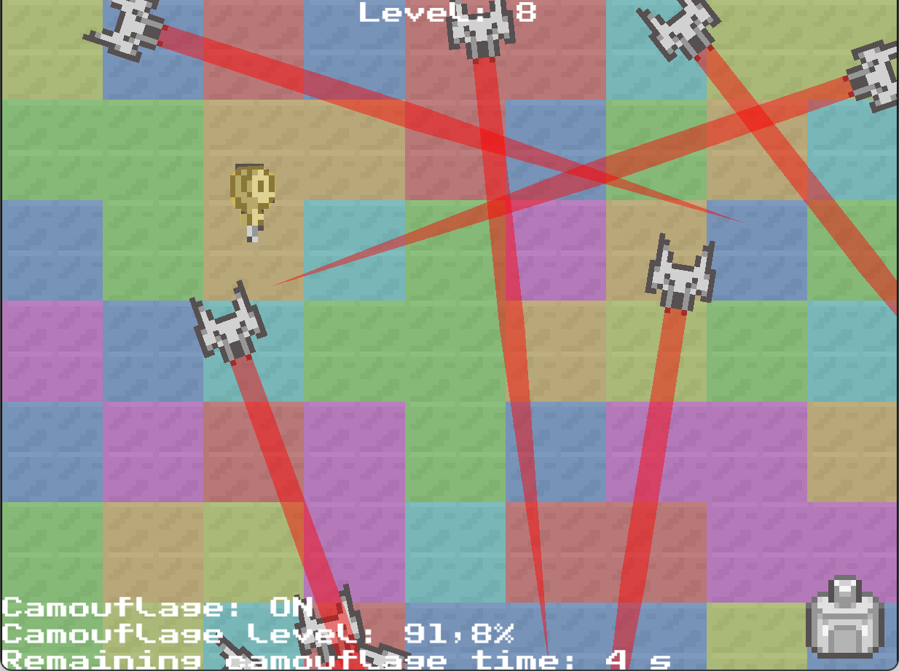
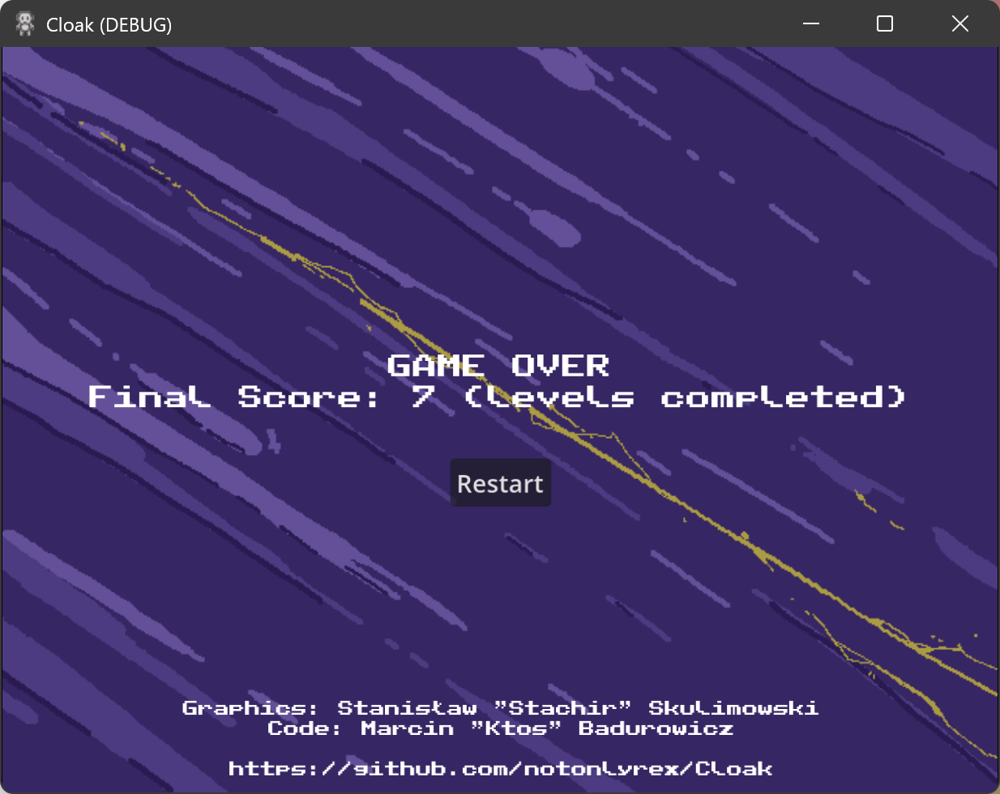

# Cloak

[Cloak](https://globalgamejam.org/games/2026/cloak-2) is game prepared for Global Game Jam 2026 (theme: "mask"), during [LubJam 2026](https://globalgamejam.org/jam-sites/2026/lubjam-2026).

You are steering a small robot, Bob, sent to a mission to check if there are enemies out there.

And they are. A lot and lot of them. And the numbers are only increasing.

You cannot get detected, so you can use an Adaptive Camouflage to mask you with the background.

## Theme & Diversifiers

"Mask" theme has been adapted - the core mechanic is masking yourself. Use an adaptive camouflage, change your color, mask with the background and you can cross the detection beams.

* Random encounter (Make the game around procedural generation) -- levels are procedurally generated.

## How to Run & Technology

The game was build using Godot Engine 4.6, with C# scripts. Some parts of the code were generated by the Copilot.

Built for Windows (x86_64 and arm64), builds are available in the Releases section.

## Authors

Code: Marcin "ktos" Badurowicz

Graphics: Stanisław "stachir" Skulimowski

## Plot (and relation to Rex)

You thought it's just a fun puzzle game of a robot sent outside?

Just after the attack the group of humans are trying to find the safe passage out of the attacked cities. They are sending remotely controlled, camouflaged robots, to look for places without enemy drones patrolling the skies.

And there are no such places. Drones are everywhere. Enemies are everywhere.

We are trapped. We need to wait for the help from Rex and the others.

Why are they returning home so slowly?

## License

Licensed under [Creative Commons Attribution-NonCommercial-ShareAlike 3.0 (CC BY-NC-SA)](https://creativecommons.org/licenses/by-nc-sa/3.0/pl/).
